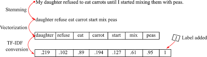
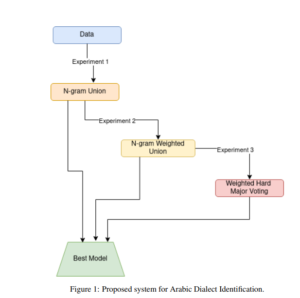
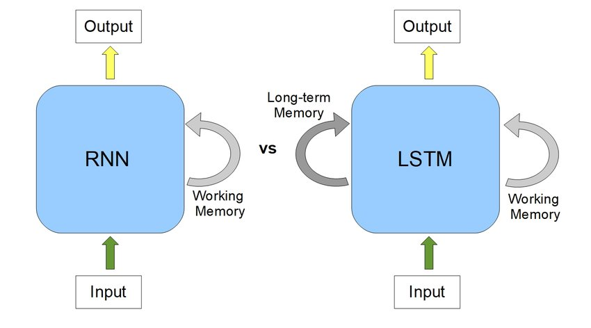
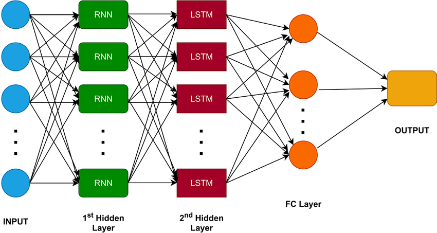

# DeepTweet: Unraveling the Linguistic Tapestry of Arabic Dialects with Machine Learning and Deep Learning

## Project Description
This project focuses on the complex classification of Arabic dialects using a combination of machine learning and deep learning techniques. We utilize various datasets like NADI 2021, IADD, and MADAR, supplemented by manually hydrated tweets, to classify 19 Arabic dialects with models like Naive Bayes, Random Forest, Logistic Regression, and deep learning models such as AraBERT and LSTM+RNN.

## Key Features
- **Arabic Dialect Classification**: Achieved an accuracy of 72% using deep learning models such as AraBERT and 62% with traditional machine learning methods like Naive Bayes.
- **Deep Learning Models**: Leveraged advanced models such as LSTM+RNN for text classification and AraBERT for pre-trained deep learning on Arabic datasets.
- **Data Sources**: Includes renowned datasets such as NADI 2021, IADD, MADAR, and manually collected tweet datasets via Twitter's API.

## Methodology
The project involves:
1. Data preparation and consolidation from multiple sources (IADD, MADAR, QADI, NADI, etc.).
2. Preprocessing of Arabic text by normalizing and tokenizing, including handling diacritics and removing non-Arabic characters.
3. Training models such as Naive Bayes, Logistic Regression, Random Forest, LSTM+RNN, and AraBERT for dialect classification.
4. Evaluation using accuracy, F1 scores, and confusion matrices.

## Model Details

### Machine Learning Models
We applied several traditional machine learning models for dialect classification:
- **Naive Bayes (NB)**: A probabilistic classifier based on Bayes’ Theorem. This model works particularly well with text classification tasks where the independence assumption between features is often violated but remains effective.
- **Random Forest (RF)**: An ensemble learning method that builds multiple decision trees and merges their outcomes to improve classification accuracy.
- **Logistic Regression (LR)**: A linear model used for binary classification, which can be extended to multi-class classification using techniques like One-vs-Rest.
- **Support Vector Machine (SVM)**: This model aims to find the hyperplane that best divides the data into classes.

These models were vectorized using **TF-IDF (Term Frequency-Inverse Document Frequency)** to convert textual data into a numerical form that machine learning algorithms can process.

#### Vectorizer Process
The TF-IDF vectorizer works by converting text into a matrix of token counts and then scaling these counts according to the importance of each word in the dataset. Words that appear frequently in one document but rarely across the dataset are given higher weights. This helps in capturing the relevance of words in each dialectal context. 




Below is a visual representation of the experimental system used for Arabic dialect identification:



### Deep Learning Models
We implemented advanced deep learning architectures that handle complex relationships in textual data, especially suited for the nuances of Arabic dialects.

#### 1. **AraBERT**
- **Model Overview**: AraBERT is a transformer-based language model specifically pre-trained for Arabic language processing. It is based on the BERT (Bidirectional Encoder Representations from Transformers) architecture, which captures the context of words in both directions (left-to-right and right-to-left).
- **Text Segmentation**: Before feeding the data into the AraBERT model, the Arabic text is segmented, which helps AraBERT to understand word morphology better.
- **Fine-tuning**: AraBERT is pre-trained on massive Arabic corpora and is fine-tuned on our dataset for the task of dialect classification. During fine-tuning, the model learns the specific nuances of the dialects.

#### 2. **LSTM + RNN (Long Short-Term Memory + Recurrent Neural Networks)**
- **Model Overview**: LSTM is a type of recurrent neural network (RNN) capable of learning long-term dependencies, making it suitable for sequence prediction tasks like text classification. LSTMs overcome the vanishing gradient problem in traditional RNNs, allowing them to retain information over longer sequences of text.




- **Architecture**: 
    - **Embedding Layer**: Converts the input tokens into dense vectors of fixed size.
    - **LSTM Layer**: Processes these vectors sequentially, capturing dependencies between words in the text.
    - **Dense Layer**: Maps the LSTM output to the final classification labels (19 dialects in our case).
- **Advantages**: LSTM models are highly effective at capturing sequential patterns in text, making them ideal for language modeling tasks like dialect identification.



#### 3. **Training Process**
- For both deep learning models, the dataset was split into training and testing sets (90% for training, 10% for testing).
- AraBERT and LSTM were trained for multiple epochs (up to 30) using a batch size of 256 to ensure convergence of the model.
- The training times varied due to the complexity of the models, with AraBERT taking the longest time due to its pre-training phase, while LSTM required slightly less computational power.

## Results

| Model                | Accuracy  | F1 Score  | Training Time |
|----------------------|-----------|-----------|---------------|
| Naive Bayes           | 62.8%     | 57.7%     | 1 minute      |
| KNN                  | 41.7%     | 39.5%     | 68 minutes    |
| Random Forest         | 46.4%     | 43.1%     | 4 hours 10 mins|
| Logistic Regression   | 56.8%     | 51.25%    | 6 hours 26 mins|
| SVM                  | 51.1%     | 49.2%     | 7 hours 15 mins|
| AraBERT              | 72.7%     | 69.89%    | 9 hours 45 mins|
| LSTM+RNN             | 64.2%     | 60.5%     | 8 hours 40 mins|

- **Confusion Matrices**: Generated to visualize model performance and precision.

## How to Run
1. Clone the repository:
    ```bash
    git clone https://github.com/Z-Nadjib/NADI-2024-Shared-Task-Multi-Classifier-Arabic-Dialect
    cd project-repo
    ```
2. Install dependencies:
    ```bash
    pip install -r requirements.txt
    ```
3. Run the notebook:
    ```bash
    jupyter notebook classification_arabic_country.ipynb
    ```

## Datasets
- **NADI 2021**: A dataset of Arabic tweets from 21 Arab countries.
- **IADD**: Integrated Arabic Dialect Identification dataset from various social media platforms.
- **MADAR**: Arabic dialect corpus from different Arab cities.
- **QADI**: Arabic Dialects Identification dataset.

Due to restrictions, you will need to hydrate some datasets using Twitter's API.

## Technologies
- Python (version 3.x)
- Jupyter Notebook
- Machine Learning: Scikit-learn
- Deep Learning: Keras, TensorFlow
- NLP libraries: NLTK, pyarabic, TextBlob

# Contact

For any questions or inquiries, please contact the project team:

- **Zahaf Boualem Nadjib** - [Email](mailto:zahafndjib@gmail.com)

- **Rabiai Mehdi Ayoub** - [Email](mailto:rabiaimehdiayoub@gmail.com)

Thank you for your interest in our project! 

## License
This project is licensed under the MIT License.
